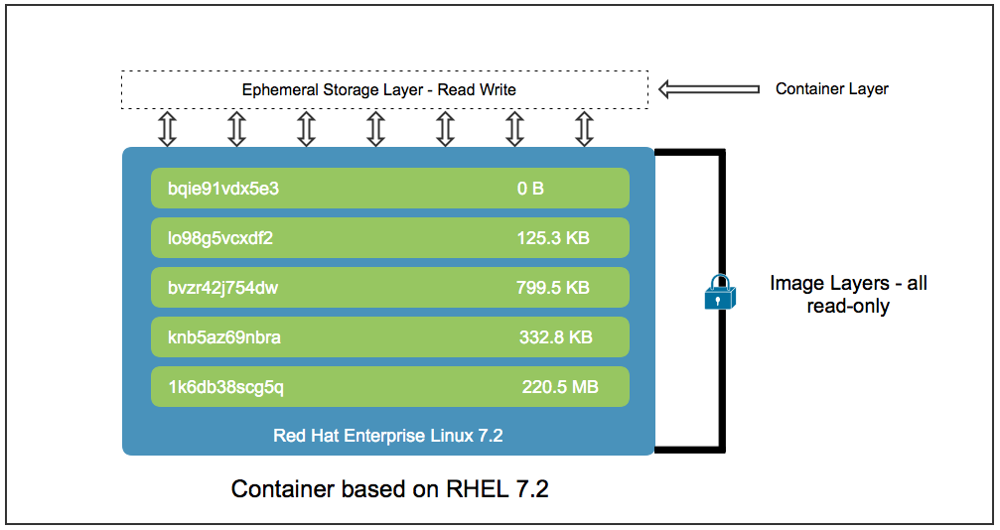

# Chapter 2 - Selecting a containerization approach.


## Build methods

I openshift kører vi applikationer i pods. Så det kører ikke helt som i docker, da det ikke bare er en container.

Containeren har oftest en applikation samt en kernel, application runtimes, libraries, etc.

| **Name**         | **Description**                                              | **Purpose** |
| ---------------- | ------------------------------------------------------------ | ----------- |
| Container images | Pre-byggede images der kan køre direkte i openshift.         |             |
| Dockerfiles      | Måske ligger der en dockerfile i kodebasen, hvilket gør det muligt at extende et image. |             |
| S2I              | Template til containere. Redhat anbefaler at man bruger S2I når muligt.  Du kan lave child images baseret på S2I child images fra redhat. |             |

## S2i

S2I har alt hvad du skal bruge for at bygge et image, så længe din applikation understøtter runtimes for det program.

## Container images

Selvom S2I er den foretruktne måde at bygge og deploye applikationer på openshift. Er der måske tidspunkter hvor man gerne vil køre et container image. Dette kan være leveret af en 3. part for eksempel.

### Redhat container catalog

Pre-byggede images kan findes på https://catalog.redhat.com/ alt redhat software findes som pre-byggede images her. https://catalog.redhat.com/software/containers/explore

Dette er en proxy for http://registry.redhat.io/ som også kan bruges når man bygger images.

### Redhat collections library

En samling af software der kan køres kontaineriseret.

### Redhat application runtimes

Gør det muligt at flytte vilkårlige applikationer til et vilkårligt openshift cluster.

## Lav dine egne contaier images med S2I

* Lav dine egne S2I images med custom build scripts
* Openshift har command line tools der hjælper dig med at bootstrappe et build enviornment,¨
* Forlæng et eksisterende S2I builder image ved at lave et child image og derved erstatte indhold fra det eksisterende builder image.

Tutorial: https://blog.openshift.com/create-s2i-builder-image/.

# 2.2 - Building Container images with advanced Containerfile Instructions

## Redhat universal base image (UBI)

Er det mest trusted linux build man kan få (i følge redhat). Det er muligt at bygge en (fairly) lightweight container ud fra dette image (alpine linux er hurtigere). Ved at bruge denne pakke kan man sikre at ens images kan bruges i et redhat openshift cluster.

UBI indeholder:

- A set of three base images (`ubi`, `ubi-minimal`, and `ubi-init`). These mirror what is provided for building containers with RHEL 7 base images.
- A set of language runtime images (`java`, `php`, `python`, `ruby`, `nodejs`). These runtime images enable developers to start developing applications with the confidence that a Red Hat built and supported container image  provides.
- A set of associated Yum  repositories and channels that include RPM packages and updates. These  allow you to add application dependencies and rebuild container images  as needed.

Typer af UBI

- ubi

  A standard base image built on enterprise-grade packages from RHEL. Good for most application use cases.

- ubi-minimal

  A minimal base image built using `microdnf`, a scaled down version of the `dnf` utility. This provides the smallest container image.

- ubi-init

  This image allows you to easily run multiple services, such as web servers,  application servers, and databases, all in a single container. It allows you to use the knowledge built into systemd unit files without having  to determine how to start the service.

### Fordele ved UBI

* Minimal størrelse (90-200 mb)
* **Sikkerhed** Provenance is a huge concern when using container base images. You must  use a trusted image, from a trusted source. Language runtimes, web  servers, and core libraries such as OpenSSL have an impact on security  when moved into production. The Universal Base Image receives timely  security updates from Red Hat security teams.
* **Performance **The base images are tested, tuned, and certified by a Red Hat internal  performance engineering team.  These are proven container images used  extensively in some of the world's most compute-intensive, I/O  intensive, and fault sensitive workloads.
* **ISV, Vendor certification og partner support** The Universal Base Image inherits the broad ecosystem of RHEL partners,  ISVs, and third-party vendors supporting thousands of applications. The  Universal Base Image makes it easy for these partners to build, deploy,  and certify their applications and allows them to deploy the resulting  containerized application on both Red Hat platforms such as RHEL and  OpenShift, as well as non-Red Hat container platforms.
* **Build once, deploy onto many different hosts** The Red Hat Universal Base Image can be built and deployed anywhere: on  OpenShift/RHEL or any other container host (Fedora, Debian, Ubuntu, and  more).

## Advanced Containerfile Instructions

Kald i dockerfiler bliver kørt sekventielt.

### RUN

Hver run command skaber et nyt lag, men det er også den mest brugte docker kommando.

Hvert lag har sit eget storage flyttet ind i sig.



## LABEL instruktionen

Med label instruktionen kan man lave labels på ens images. 

Alle typer platforme har deres egen måde at se labels på. I openshift og kubernetes er der forskellige typer labels.

| Label Name                     | Description                                                  |
| ------------------------------ | ------------------------------------------------------------ |
| `io.openshift.tags`            | This label contains a list of  comma-separated tags. Tags categorize container images into broad areas  of functionality. Tags help UI and generation tools to suggest relevant  container images during the application creation process. |
| `io.k8s.description`           | This label provides consumers of the  container image more detailed information about the service or  functionality that the image provides. |
| `io.openshift.expose-services` | This label contains a list of service ports that match the `EXPOSE` instructions in the Containerfile and provides more descriptive information about what actual service is provided to consumers. The format is `PORT[/PROTO]:NAME` where `[/PROTO]` is optional and it defaults to `tcp` if not specified. |

## ONBUILD instruktionen

Kører når et image bliver bygget (Fra et child image)

## Openshift considerations for bruger instruktionen

* Mapper ofg filer der er læst fra eller skrevet til at processer i en container burde ejes af root gruppen og have read og eller write permissions
* Filer der er ekskverbare skal have gruppe eksekverbare permissions
* Processorne der kører i en container kan ikke lytte til priviligerede porte (porte under 1024), fordi de ikke kører som priviligerede brugere

Adding the following RUN instruction to your Containerfile sets the directory and file permissions to allow users in the `root` group to access them in the container:

```
RUN chgrp -R 0 directory && \
    chmod -R g=u directory
```

Brugeren der kører containeren er altid i root gruppen. Derfor kan containeren læse og skrive til dette directory. 

g=u argumentet fra chmod commandoen gør gruppe adgangen lig med ejerens bruger permissions, hvilket som default er read og write. du kan bruge g+rwX argumentet med samme resultater.

### Kør containere som root ved brug af Security Context Constraints (SCC)

Hvis du får leveret et image kan det være nødvendigt at køre dette image som en root user. Openshift tillader SCC der kontrollerer handlinger som denne pod kan udføre og hvilke resourcer den kan tilgå. Openshift sendes med et antal af indbyggede SCC'er. All containere lavet af openshift bruger SCC'en ved navn *restricted* pr. default der ignorer userid'et sat af container imaget og giver et random userid til containers.

For at tillade containers at bruge et fixed userid såsom 0 (root brugeren), er du nødt til at bruge anyuidSCC. For at gøre sådan er du først nødt til at kave en service account. En service account er openshift identiteten for en pod. Alle pods fra et projekt kører under en default service account, undtagen hvis podden eller dets deployment configuration er configureret på anden måde.

Hvis du har en application der kræver noget der ikke er givet af den restricede SCC, så lav en ny specifik service account og tilføj den til den ønskede SCC og derefter ændre deploymentConfig der laver applicationens pods for at bruge den nye service account.

- Create a new service account:

  ```bash
  [user@host ~]$ oc create serviceaccount myserviceaccount
  ```

- Modify the deployment configuration for the application to use the new service account. Use the `oc patch` command to do this:

  ```bash
  [user@host ~]$ oc patch dc/demo-app --patch \
  '{"spec":{"template":{"spec":{"serviceAccountName": "myserviceaccount"}}}}'
  ```

### Note

For details on how to use the `oc patch` command, see [OpenShift admins guide to oc patch](https://access.redhat.com/articles/3319751). Run the `oc patch -h` command to display usage.

- Add the `myserviceaccount` service account to the `anyuid` SCC to run using a fixed userid in the container:

  ```bash
  [user@host ~]$ oc adm policy add-scc-to-user anyuid -z myserviceaccount
  ```

# Injecting Configuration Data into an Application

Ting som Config maps og secrets puttes ind i et image ved runtime. Secrets bliver encrypted i base64

## Injecting Data from Secrets and Configuration Maps into Applications

Configuration maps and secrets can be mounted as data volumes, or exposed as  environment variables, inside an application container.

To inject all values stored in a configuration map into environment variables for pods created from a deployment, use the `oc set env` command:

```
[user@host ~]$ oc set env deployment/mydcname \
--from configmap/myconf
```

To mount all keys from a configuration map as files from a volume inside pods created from a deployment, use the `oc set volume` command:

```
[user@host ~]$ oc set volume deployment/mydcname --add \
-t configmap -m /path/to/mount/volume \
--name myvol --configmap-name myconf
```

To inject data inside a secret into pods created from a deployment, use the `oc set env` command:

```
[user@host ~]$ oc set env deployment/mydcname \
--from secret/mysecret
```

To mount data from a secret resource as a volume inside pods created from a deployment, use the `oc set volume` command:

```
[user@host ~]$ oc set volume deployment/mydcname --add \
-t secret -m /path/to/mount/volume \
--name myvol --secret-name mysecret
```

## Application Configuration Options

Use configuration maps to store configuration data in plain text and if the information is not sensitive. Use secrets if the information you are  storing is sensitive.

If your application  only has a few simple configuration variables that can be read from  environment variables or passed on the command line, use environment  variables to inject data from configuration maps and secrets.  Environment variables are the preferred approach over mounting volumes  inside the container.

On the other hand, if  your application has a large number of configuration variables, or if  you are migrating a legacy application that makes extensive use of  configuration files, use the volume mount approach instead of creating  an environment variable for each of the configuration variables. For  example, if your application expects one or more configuration files  from a specific location on your file system, you should create secrets  or configuration maps from the configuration files and mount them inside the container ephemeral file system at the location that the  application expects.

To accomplish that goal, with secrets pointing to `/home/student/configuration.properties` file, use the following command:

```
[user@host ~]$ oc create secret generic security \
--from-file /home/student/configuration.properties
```

To inject the secret into the application, configure a volume that refers  to the secrets created in the previous command. The volume must point to an actual directory inside the application where the secrets file is  stored.

In the following example, the `configuration.properties` file is stored in the `/opt/app-root/secure` directory. To bind the file to the application, configure the deployment configuration from the application (`dc/application`):

```
[user@host ~]$ *oc set volume deployment/application --add \
-t secret -m /opt/app-root/secure \
--name myappsec-vol --secret-name security *
```

To create a configuration map, use the following command:

```
[user@host ~]$ oc create configmap properties \
--from-file /home/student/configuration.properties
```

To bind the application to the configuration map, update the deployment  configuration from that application to use the configuration map:

```
[user@host ~]$ oc set env deployment/application \
--from configmap/properties
```

#### Configuration Map and Secret Resource Definitions

Because configuration maps and secrets are regular OpenShift resources, you can use either the `oc create` command or the web console to import these resource definition files in YAML or JSON format.

A sample configuration map resource definition in YAML format is shown below:

```
apiVersion: v1
data:
    key1: value1 
    key2: value2 
kind: ConfigMap 
metadata:
    name: myconf 
```

| [](https://rol.redhat.com/rol/app/#designing-configuration-lecture-CO1-1) | The name of the first key. By default, an environment variable or a file  the with same name as the key is injected into the container depending  on whether the configuration map resource is injected as an environment  variable or a file. |
| ------------------------------------------------------------ | ------------------------------------------------------------ |
| [](https://rol.redhat.com/rol/app/#designing-configuration-lecture-CO1-2) | The value stored for the first key of configuration map.     |
| [](https://rol.redhat.com/rol/app/#designing-configuration-lecture-CO1-3) | The name of the second key.                                  |
| [](https://rol.redhat.com/rol/app/#designing-configuration-lecture-CO1-4) | The value stored for the second key of the configuration map. |
| [](https://rol.redhat.com/rol/app/#designing-configuration-lecture-CO1-5) | The OpenShift resource type; in this case, a configuration map. |
| [](https://rol.redhat.com/rol/app/#designing-configuration-lecture-CO1-6) | A unique name for this configuration map inside a project.   |

A sample secret resource in YAML format is shown below:

```
apiVersion: v1
data:
    username: cm9vdAo= 
    password: c2VjcmV0Cg== 
kind: Secret 
metadata:
    name: mysecret 
    type: Opaque
```

| [](https://rol.redhat.com/rol/app/#designing-configuration-lecture-CO2-1) | The name of the first key. This provides the default name for either an  environment variable or a file in a pod, in the same way as key names  from a configuration map. |
| ------------------------------------------------------------ | ------------------------------------------------------------ |
| [](https://rol.redhat.com/rol/app/#designing-configuration-lecture-CO2-2) | The value stored for the first key, in base64-encoded format. |
| [](https://rol.redhat.com/rol/app/#designing-configuration-lecture-CO2-3) | The name of the second key.                                  |
| [](https://rol.redhat.com/rol/app/#designing-configuration-lecture-CO2-4) | The value stored for the second key, in base64-encoded format. |
| [](https://rol.redhat.com/rol/app/#designing-configuration-lecture-CO2-5) | The OpenShift resource type; in this case, a secret.         |
| [](https://rol.redhat.com/rol/app/#designing-configuration-lecture-CO2-6) | A unique name for this secret resource inside a project.     |

#### Alternative Syntax for Secret Resource Definitions

A template cannot define secrets using the standard syntax, because all  key values are encoded. OpenShift provides an alternative syntax for  this scenario, where the `stringData` attribute replaces the `data` attribute, and the key values are not encoded.

Using the alternative syntax, the previous example becomes:

```
apiVersion: v1
stringData:
    username: user1
    password: pass1
kind: Secret
metadata:
    name: mysecret
    type: Opaque
```

The alternative syntax is never saved in the  OpenShift master etcd database. OpenShift converts secret resources defined using the alternative syntax into the standard representation for storage. If you run `oc get` with a secret that was created using the alternative syntax, you get a resource using the standard syntax.

#### Commands to Manipulate Configuration Maps

To view the details of a configuration map in JSON format, or to export a  configuration map resource definition to a JSON file for offline  creation:

```
[user@host ~]$ oc get configmap/myconf -o json
```

To delete a configuration map:

```
[user@host ~]$ oc delete configmap/myconf
```

To edit a configuration map, use the `oc edit` command. This command opens a Vim-like buffer by default, with the configuration map resource definition in YAML format:

```
[user@host ~]$ oc edit configmap/myconf
```

Use the `oc patch` command to edit a configuration map resource. This approach is  noninteractive and is useful when you need to script the changes to a  resource:

```
[user@host ~]$ oc patch configmap/myconf --patch '{"data":{"key1":"newvalue1"}}'
```

#### Commands to Manipulate Secrets

The commands to manipulate secret resources are similar to those used for configuration map resources.

To view or export the details of a secret:

```
[user@host ~]$ oc get secret/mysecret -o json
```

To delete a secret:

```
[user@host ~]$ oc delete secret/mysecret
```

To edit a secret, first encode your data in base64 format, for example:

```
[user@host ~]$ echo 'newpassword' | base64
bmV3cGFzc3dvcmQK
```

Use the encoded value to update the secret resource using the `oc edit` command:

```
[user@host ~]$ oc edit secret/mysecret
```

You can also edit a secret resource using the `oc patch` command:

```
[user@host ~]$ oc patch secret/mysecret --patch \
'{"data":{"password":"bmV3cGFzc3dvcmQK"}}'
```

Configuration maps and secrets can also be changed and deleted using the OpenShift web console.

### Injecting Data from Secrets and Configuration Maps into Applications

Configuration maps and secrets can be mounted as data volumes, or exposed as  environment variables, inside an application container.

To inject all values stored in a configuration map into environment variables for pods created from a deployment, use the `oc set env` command:

```
[user@host ~]$ oc set env deployment/mydcname \
--from configmap/myconf
```

To mount all keys from a configuration map as files from a volume inside pods created from a deployment, use the `oc set volume` command:

```
[user@host ~]$ oc set volume deployment/mydcname --add \
-t configmap -m /path/to/mount/volume \
--name myvol --configmap-name myconf
```

To inject data inside a secret into pods created from a deployment, use the `oc set env` command:

```
[user@host ~]$ oc set env deployment/mydcname \
--from secret/mysecret
```

To mount data from a secret resource as a volume inside pods created from a deployment, use the `oc set volume` command:

```
[user@host ~]$ oc set volume deployment/mydcname --add \
-t secret -m /path/to/mount/volume \
--name myvol --secret-name mysecret
```

### Application Configuration Options

Use configuration maps to store configuration data in plain text and if the information is not sensitive. Use secrets if the information you are  storing is sensitive.

If your application  only has a few simple configuration variables that can be read from  environment variables or passed on the command line, use environment  variables to inject data from configuration maps and secrets.  Environment variables are the preferred approach over mounting volumes  inside the container.

On the other hand, if  your application has a large number of configuration variables, or if  you are migrating a legacy application that makes extensive use of  configuration files, use the volume mount approach instead of creating  an environment variable for each of the configuration variables. For  example, if your application expects one or more configuration files  from a specific location on your file system, you should create secrets  or configuration maps from the configuration files and mount them inside the container ephemeral file system at the location that the  application expects.

To accomplish that goal, with secrets pointing to `/home/student/configuration.properties` file, use the following command:

```
[user@host ~]$ oc create secret generic security \
--from-file /home/student/configuration.properties
```

To inject the secret into the application, configure a volume that refers  to the secrets created in the previous command. The volume must point to an actual directory inside the application where the secrets file is  stored.

In the following example, the `configuration.properties` file is stored in the `/opt/app-root/secure` directory. To bind the file to the application, configure the deployment configuration from the application (`dc/application`):

```
[user@host ~]$ *oc set volume deployment/application --add \
-t secret -m /opt/app-root/secure \
--name myappsec-vol --secret-name security *
```

To create a configuration map, use the following command:

```
[user@host ~]$ oc create configmap properties \
--from-file /home/student/configuration.properties
```

To bind the application to the configuration map, update the deployment  configuration from that application to use the configuration map:

```
[user@host ~]$ oc set env deployment/application \
--from configmap/properties
```