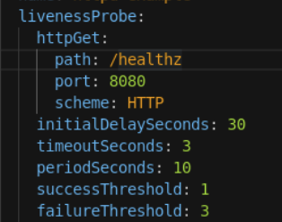

# Chapter 7. Managing Application Deployments

Applications can become unreliable for a variety of reasons, for example:

- Temporary connection loss
- Configuration errors
- Application errors

Man kan bruge probes til at holde øje med en container. 

## Probe typer

### Startup probe

### Readiness Probe probe

### Liveness Probe

Red Hat OpenShift provides five options that control these probes:

| Name                  | Mandatory | Description                                                  | Default Value |
| --------------------- | --------- | ------------------------------------------------------------ | ------------- |
| `initialDelaySeconds` | Yes       | Determines how long to wait after the container starts before beginning the probe. | 0             |
| `timeoutSeconds`      | Yes       | Determines how long to wait for the probe to finish. If this time is exceeded, Red Hat OpenShift assumes that the probe failed. | 1             |
| `periodSeconds`       | No        | Specifies the frequency of the checks.                       | 1             |
| `successThreshold`    | No        | Specifies the minimum consecutive successes for the probe to be considered successful after it has failed. | 1             |
| `failureThreshold`    | No        | Specifies the minimum consecutive failures for the probe to be considered failed after it has succeeded. | 3             |

## Methods of Checking Application Health

### HTTP Check

Dette kan gøres med en HTTP probe der bruger en get request itl at checke health på en applikation. Dette kald er succesfuldt hvis et response er mellem 200-399

```
...contents omitted...
readinessProbe:
  httpGet:
    path: /health
    port: 8080
  initialDelaySeconds: 15
  timeoutSeconds: 1
...contents omitted...
```

| [](https://rol.redhat.com/rol/app/#managing-probes-lecture-CO1-1) | The readiness probe endpoint.                                |
| ------------------------------------------------------------ | ------------------------------------------------------------ |
| [](https://rol.redhat.com/rol/app/#managing-probes-lecture-CO1-2) | How long to wait after the container starts before checking its health. |
| [](https://rol.redhat.com/rol/app/#managing-probes-lecture-CO1-3) | How long to wait for the probe to finish.                    |


### Container Execution Checks

Tjekker status af en container baseret på en exit kode af et shell script der kører i containeren. 

```
...contents omitted...
livenessProbe:
  exec:
    command:
    - cat
    - /tmp/health
  initialDelaySeconds: 15
  timeoutSeconds: 1
...contents omitted...
```

| [](https://rol.redhat.com/rol/app/#managing-probes-lecture-CO2-1) | The command to run and its arguments, as a YAML array. |
| ------------------------------------------------------------ | ------------------------------------------------------ |
|                                                              |                                                        |

### TCP Socket Checks

Hvis din applikation ikke bruger HTTP kan det være nødvendigt at bruge et socket check. For eksempel på en database.

```
...contents omitted...
livenessProbe:
  tcpSocket:
    port: 8080
  initialDelaySeconds: 15
  timeoutSeconds: 1
...contents omitted...
```

| [](https://rol.redhat.com/rol/app/#managing-probes-lecture-CO3-1) | The TCP port to check |
| ------------------------------------------------------------ | --------------------- |
|                                                              |                       |

## Manage Probes By Using the Web Console

Udviklere kan sætte probes op ved at editere i Deployment YAML filen. Enten med oc edit eller redhat openshift web consollen.

Dette kan gøres i web konsollen via Workloads → Deployment → <deployment name> . Klik på dropdownen og vælg "edit deployment"

Et eksempel på en liveness probe



Man kan få shortcuts i web konsollen, hvilket er ret lækkert.

## Creating probes using the CLI

oc set probe kommandoen giver dig mulighed for at sætte en probe sammen med en række parametre såsom URL, timeout, period og mere.

```bash
oc set probe deployment myapp --readiness --get-url=http://:8080/healthz --period=20
```

```bash
oc set probe deployment myapp --liveness --open-tcp=3306 --period=20 --timeout-seconds=1
```

```bash
oc set probe deployment myapp --liveness --get-url=http://:8080/healthz --initial-delay-seconds=30 --success-threshold=1 --failure-threshold=3
```

brug oc set probe --help for at få hjælp til kommandoer.

# Selecting the Appropriate Deployment Strategy

**Hint**: Deployment er en openshift ting, DeploymentConfig er ikke. Deployment understøtter ikke custom deployment strategier.

`DeploymentConfig` resource tillader dig at bruge additional features, såsom:

- Custom deployment strategies
- Lifecycle hooks

## Deployment Strategies in Red Hat OpenShift

Hvordan deployer man en app, og endnu vigtigere - Hvordan redeployer man og opdaterer.

Red Hat OpenShift provides several deployment strategies. These strategies can be organized into two primary categories:

- By using the deployment strategy defined in the application deployment configuration.
- By using the Red Hat OpenShift router to route traffic to specific application pods.

### Rolling

Dette er default strategien. Denne strategi erstatter prograssivt instanser af en tidligere version af en applikation med instanser af den nye version af denne applikation. Denne strategi eksekverer readiness probes til at derminere hvornår en pod er klar.

**Andrew**:

*Du deployer en ny pod med en ny version af en applikation. Hvis den passer alle checks så destroyes gamle og den nye pod deployer.*

Use a rolling deployment strategy when:

- You require no downtime during an application update.
- Your application supports running an older version and a newer version at the same time.

### Recreate

Openshift stopper alle pods der er igang og starter dem kun op med en ny version af applikationen. Denne strategi resulterer i downtime i en kort periode.

Brug strategien når:

- Your application does not support running an older version and a newer version at the same time.
- Your application uses a persistent volume with RWO (ReadWriteOnce) access mode, which does not allow writes from multiple pods.

### Custom

## Integrating Red Hat OpenShift Deployments with Life-cycle Hooks

### Pre-Lifecycle Hook

Red Hat OpenShift executes the pre-life-cycle hook before any new pods for a  deployment start, and also before any older pods shut down.

### Mid-Lifecycle Hook (replace strategy)

The mid-life-cycle hook is executed after all the old pods in a deployment  have been shut down, but before any new pods are started. Mid-Lifecycle  Hooks are only available for the `Recreate` strategy.

### Post-Lifecycle Hook

The post-life-cycle hook is executed after all new pods for a deployment  have started, and after all the older pods have shut down.

Disse lifecycle hooks er defineret i strategi resourcen under en af disse 3 attributter

- `rollingParams` for `Rolling` strategies.
- `recreateParams` for `Recreate` strategies.
- `customParams` for `Custom` strategies.

Du kan tilføje pre, mid og post attributten der indeholder lifecycle hooks.

Life-cycle hooks kører i seperate containere der er kortlivede. Openshift rydder automatisk op efter de er færdige med at eksekvere. Automatisk database inistantiering og database migreringer er gode use cases for life-cycle hooks.


Hvert hook har `failurePolicy`, attribute, der definerer handlingen for når et hook failure sker. Der er 3 policies:

- Abort: The deployment process is considered a failure if the hook fails.
- Retry: Retry the hook execution until it succeeds.
- Ignore: Ignore any hook failure and allow the deployment to proceed.

## Implementing Advanced Deployment Strategies Using the Red Hat OpenShift Router

### Blue-Green Deployment

In Blue-Green deployments, you have two identical environments  running concurrently, where each environment runs a different version of the application.

The Red Hat OpenShift router is used to direct  traffic from the current in-production version (Green) to the newer  updated version (Blue). You can implement this strategy using a route  and two services. Define a service for each specific version of the  application.

The route points to one of the services at any given  time, and can be changed to point to a different service when ready, or  to facilitate a rollback. As a developer, you can test the new version  of your application by connecting to the new service before routing your production traffic to it. When your new application version is ready  for production, change the production router to point to the new service defined for your updated application.

### A/B Deployment

The A/B deployment strategy allows you to deploy a new version of the application for a limited set of users in the production  environment. You can configure Red Hat OpenShift so that it routes the  majority of requests to the currently deployed version in a production  environment, while a limited number of requests go to the new version.

By controlling the portion of requests sent to each version as testing  progresses, you can gradually increase the number of requests sent to  the new version. Eventually, you can stop routing traffic to the  previous version. As you adjust the request load on each version, the  number of pods in each service may need to be scaled to provide the  expected performance.

Additionally, consider N-1 compatibility and graceful termination:

### N-1 Compabilitet

Many deployment strategies require two versions of the application to be running at the same time. When running two versions of an  application simultaneously, ensure that data written by the new code can be read and handled (or gracefully ignored) by the old version of the  code; this is called N-1 Compatibility.

The  data managed by the application can take many forms: data stored on  disk, in a database, or in a temporary cache. Most well designed  stateless web applications can support rolling deployments, but it is  important to test and design your application to handle N-1  compatibility.

### Graceful termination

Red Hat OpenShift allows application instances to shut down  gracefully before removing the instances form the router's  load-balancing roster. Applications must ensure they gracefully  terminate user connections before they exit.

Red Hat OpenShift sends a `SIGTERM` signal to the processes in the container when it wants to shut it down. Application code, on receiving a `SIGTERM` signal, should stop accepting new connections. Stopping new connections ensures that the router can route traffic to other active instances.  The application code should then wait until all open connections are  closed (or gracefully terminate individual connections at the next  opportunity) before exiting.

After the graceful termination period has expired, Red Hat OpenShift sends a `SIGKILL` signal to any process that has not exited. This immediately ends the process. The `terminationGracePeriodSeconds` attribute of a pod or pod template controls the graceful termination  period (the default is 30 seconds), and can be customized per  application.

# 7.5 - Managing Application Deployments with CLI Commands

## Deployment Configuration

En deployment configuration definerer en template for pods og håndterer deployment af nye images eller konfigurations ændringer når atributterne ændres. Deployment konfigurationer kan understøtte mange forskellige deployment patterns inklusive fuld restart, Kustomerbare rolling opdateringer og pre og post life cycle hooks.

Openshift opretter automatisk en replication controller der representer deployment konfigurations pod templaten når du laver en ny deployment configuration.

Når deployment konfigurationen ændrer sig laver Openshift en ny replication controller med den nyeste pod template og en deployment process der køre for at ned skallere den gamle replication controller og skalerer den nye op. Openshift tilføjer og fjerner også automatisk nye instanser af applikationen fra både service og loadbancersm routers for at starte og stoppe disse.

En deployment config er ærkllæret med en DeploymentConfig attribute i en resource fil der kan være i YAML eller JSON format. Brug `oc` kommandoen for at håndtere deployment configurationen ligesom en hver anden Openshift resource. Den følgende template viser en deployment configuration i YAML format

```bash
kind: "DeploymentConfig"
apiVersion: "v1"
metadata:
  name: "frontend" 
spec:
...
  replicas: 5 
  selector:
    name: "frontend"
  triggers:
    - type: "ConfigChange" 
    - type: "ImageChange" 
      imageChangeParams:
...
  strategy:
    type: "Rolling"
...
```

| [](https://rol.redhat.com/rol/app/#managing-cli-lecture-CO1-1) | The deployment configuration name.                           |
| ------------------------------------------------------------ | ------------------------------------------------------------ |
| [](https://rol.redhat.com/rol/app/#managing-cli-lecture-CO1-2) | The number of replicas to run.                               |
| [](https://rol.redhat.com/rol/app/#managing-cli-lecture-CO1-3) | A configuration change trigger that causes a new replication controller  to be created when there are changes to the deployment configuration. |
| [](https://rol.redhat.com/rol/app/#managing-cli-lecture-CO1-4) | An image change trigger that causes a new replication controller to be  created each time a new version of the image is available. |

## Håndtering af deployment med CLI kommandoer

Start en deployment - latest indikerer at vi vil have den nyeste version af templaten. Bruges ofte til at starte en ny deployment eller opgradere en applikation til den nyeste version.

```bash
oc rollout latest dc/name
```

Se history for en deployment for en specifik konfiguration

```bash
oc rollout history dc/name
```

For at se detaljer omkring en specifik deployment, append revision

```bash
oc rollout history dc/name --revision=1
```

For at få adgang til detaljer om en deployment config og dets sidste revision

```
oc describe dc name
```

For at afbryde en deployment configuration

```
oc rollout cancel dc/name
```

For at prøve at eksekvere en deployment config igen

```
oc rollout retry dc/name
```