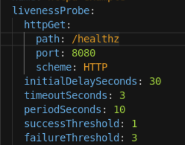

# Chapter 7. Managing Application Deployments

Applications can become unreliable for a variety of reasons, for example:

- Temporary connection loss
- Configuration errors
- Application errors

Man kan bruge probes til at holde øje med en container. 

## Probe typer

### Startup probe

### Readiness Probe probe

### Liveness Probe

Red Hat OpenShift provides five options that control these probes:

| Name                  | Mandatory | Description                                                  | Default Value |
| --------------------- | --------- | ------------------------------------------------------------ | ------------- |
| `initialDelaySeconds` | Yes       | Determines how long to wait after the container starts before beginning the probe. | 0             |
| `timeoutSeconds`      | Yes       | Determines how long to wait for the probe to finish. If this time is exceeded, Red Hat OpenShift assumes that the probe failed. | 1             |
| `periodSeconds`       | No        | Specifies the frequency of the checks.                       | 1             |
| `successThreshold`    | No        | Specifies the minimum consecutive successes for the probe to be considered successful after it has failed. | 1             |
| `failureThreshold`    | No        | Specifies the minimum consecutive failures for the probe to be considered failed after it has succeeded. | 3             |

## Methods of Checking Application Health

### HTTP Check

Dette kan gøres med en HTTP probe der bruger en get request itl at checke health på en applikation. Dette kald er succesfuldt hvis et response er mellem 200-399

```
...contents omitted...
readinessProbe:
  httpGet:
    path: /health
    port: 8080
  initialDelaySeconds: 15
  timeoutSeconds: 1
...contents omitted...
```

| [](https://rol.redhat.com/rol/app/#managing-probes-lecture-CO1-1) | The readiness probe endpoint.                                |
| ------------------------------------------------------------ | ------------------------------------------------------------ |
| [](https://rol.redhat.com/rol/app/#managing-probes-lecture-CO1-2) | How long to wait after the container starts before checking its health. |
| [](https://rol.redhat.com/rol/app/#managing-probes-lecture-CO1-3) | How long to wait for the probe to finish.                    |


### Container Execution Checks

Tjekker status af en container baseret på en exit kode af et shell script der kører i containeren. 

```
...contents omitted...
livenessProbe:
  exec:
    command:
    - cat
    - /tmp/health
  initialDelaySeconds: 15
  timeoutSeconds: 1
...contents omitted...
```

| [](https://rol.redhat.com/rol/app/#managing-probes-lecture-CO2-1) | The command to run and its arguments, as a YAML array. |
| ------------------------------------------------------------ | ------------------------------------------------------ |
|                                                              |                                                        |

### TCP Socket Checks

Hvis din applikation ikke bruger HTTP kan det være nødvendigt at bruge et socket check. For eksempel på en database.

```
...contents omitted...
livenessProbe:
  tcpSocket:
    port: 8080
  initialDelaySeconds: 15
  timeoutSeconds: 1
...contents omitted...
```

| [](https://rol.redhat.com/rol/app/#managing-probes-lecture-CO3-1) | The TCP port to check |
| ------------------------------------------------------------ | --------------------- |
|                                                              |                       |

## Manage Probes By Using the Web Console

Udviklere kan sætte probes op ved at editere i Deployment YAML filen. Enten med oc edit eller redhat openshift web consollen.

Dette kan gøres i web konsollen via Workloads → Deployment → <deployment name> . Klik på dropdownen og vælg "edit deployment"

Et eksempel på en liveness probe



Man kan få shortcuts i web konsollen, hvilket er ret lækkert.

## Creating probes using the CLI

oc set probe kommandoen giver dig mulighed for at sætte en probe sammen med en række parametre såsom URL, timeout, period og mere.

```bash
oc set probe deployment myapp --readiness --get-url=http://:8080/healthz --period=20
```

```bash
oc set probe deployment myapp --liveness --open-tcp=3306 --period=20 --timeout-seconds=1
```

```bash
oc set probe deployment myapp --liveness --get-url=http://:8080/healthz --initial-delay-seconds=30 --success-threshold=1 --failure-threshold=3
```

brug oc set probe --help for at få hjælp til kommandoer.